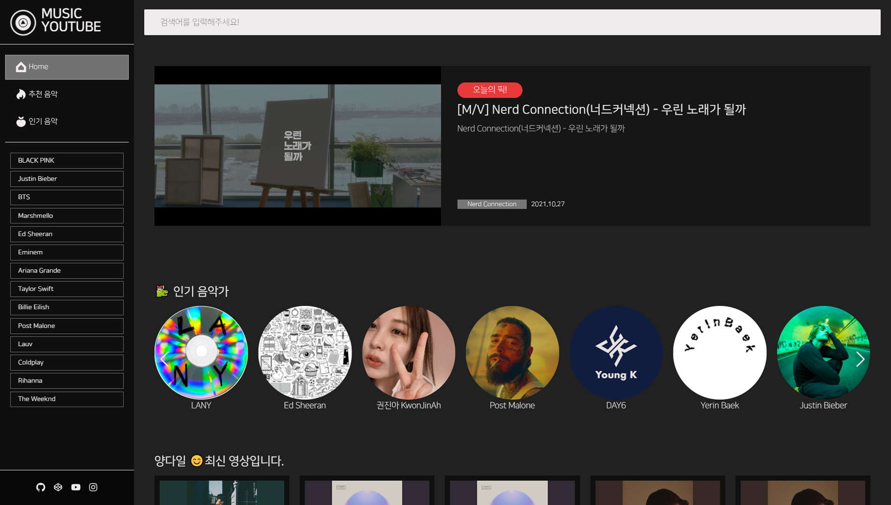

# 나만의 음악 유튜브 사이트 만들기
유튜브 API를 이용하여 평소에 제가 좋아하는 뮤지션들과 유튜브 구독자 수가 많은 랭킹 순으로 다양한 뮤지션들의 음악을 들어볼 수 있는 사이트를 만들었습니다.

## 미리보기

<div align=center>

</div>

## filetree

<details>
<summary>filetree</summary>

```
📦youtube-project
┣ 📂public
┃ ┣ 📜favicon.svg
┃ ┗ 📜index.html
┣ 📂src
┃ ┣ 📂assets
┃ ┃ ┣ 📂fonts
┃ ┃ ┣ 📂img
┃ ┃ ┃ ┣ 📂icon
┃ ┃ ┗ 📂scss
┃ ┃ ┃ ┣ 📂section
┃ ┃ ┃ ┃ ┣ 📜_channel.scss
┃ ┃ ┃ ┃ ┣ 📜_header.scss
┃ ┃ ┃ ┃ ┣ 📜_layout.scss
┃ ┃ ┃ ┃ ┣ 📜_search.scss
┃ ┃ ┃ ┃ ┣ 📜_swiper.scss
┃ ┃ ┃ ┃ ┣ 📜_today.scss
┃ ┃ ┃ ┃ ┣ 📜_video.scss
┃ ┃ ┃ ┃ ┗ 📜_musician.scss
┃ ┃ ┃ ┣ 📂setting
┃ ┃ ┃ ┃ ┣ 📜_common.scss
┃ ┃ ┃ ┃ ┣ 📜_fonts.scss
┃ ┃ ┃ ┃ ┣ 📜_mixin.scss
┃ ┃ ┃ ┃ ┣ 📜_reset.scss
┃ ┃ ┃ ┃ ┗ 📜_var.scss
┃ ┃ ┃ ┗ 📜style.scss
┃ ┣ 📂components
┃ ┃ ┣ 📂contents
┃ ┃ ┃ ┣ 📜Today.jsx
┃ ┃ ┃ ┗ 📜Musician.jsx
┃ ┃ ┣ 📂header
┃ ┃ ┃ ┣ 📜Logo.jsx
┃ ┃ ┃ ┣ 📜Menu.jsx
┃ ┃ ┃ ┗ 📜Sns.jsx
┃ ┃ ┣ 📂section
┃ ┃ ┃ ┣ 📜Footer.jsx
┃ ┃ ┃ ┣ 📜Header.jsx
┃ ┃ ┃ ┣ 📜Main.jsx
┃ ┃ ┃ ┗ 📜Search.jsx
┃ ┃ ┗ 📂video
┃ ┃ ┃ ┣ 📜VideoSearch.jsx
┃ ┃ ┃ ┗ 📜VideoSlider.jsx
┃ ┣ 📂data
┃ ┃ ┣ 📜header.js
┃ ┃ ┣ 📜today.js
┃ ┃ ┗ 📜musician.jsx
┃ ┣ 📂pages
┃ ┃ ┣ 📜Channel.jsx
┃ ┃ ┣ 📜Home.jsx
┃ ┃ ┣ 📜Search.jsx
┃ ┃ ┣ 📜Today.jsx
┃ ┃ ┣ 📜Video.jsx
┃ ┃ ┗ 📜Musician.jsx
┃ ┣ 📂utils
┃ ┃ ┣ 📜api.js
┃ ┃ ┗ 📜scrollto.js
┃ ┣ 📜App.js
┃ ┗ 📜index.js
┣ 📜.env
┣ 📜.gitignore
┣ 📜package-lock.json
┣ 📜package.json
┗ 📜README.md
```

</details>

## staks

    

## 라이브러리 설치

```
npm install react-router-dom
npm install axios react-icons
npm install react-player
npm install sass
npm install swiper
react-helmet-async swiper
```

1. react-router-dom: React 애플리케이션에서 라우팅을 구현하기 위한 패키지입니다. URL 경로에 따라 다른 컴포넌트를 렌더링하거나 페이지 간의 전환을 관리할 수 있습니다.
2. axios: HTTP 요청을 보내고 응답을 받기 위한 패키지입니다. 서버와의 API 통신이나 데이터 요청에 사용될 수 있습니다.
3. react-icons: 다양한 아이콘을 사용하기 위한 패키지입니다. React 컴포넌트 형태로 아이콘을 쉽게 표현할 수 있습니다.
4. react-player: 비디오나 오디오 재생을 위한 패키지입니다. 다양한 형식의 미디어 파일을 재생하고 컨트롤할 수 있습니다.
5. react-helmet-async: 동적으로 HTML <head> 요소를 수정하기 위한 패키지입니다. 페이지의 제목, 메타 태그, 스타일 시트 등을 동적으로 변경할 수 있습니다.
6. swiper: 모바일 터치 슬라이더나 갤러리 형식의 컴포넌트를 만들기 위한 패키지입니다. 다양한 슬라이드 효과와 인터랙션을 구현할 수 있습니다.

## 제작순서

1. 페이지 구성: 'Home', 'Today', 'Youtubers' 페이지를 세분화하여 기본적인 웹사이트 구조를 구축했습니다.
2. data.js 작업 및 컴포넌트 세분화: 데이터 관리를 위한 data.js 파일을 작성하고, 컴포넌트 프롭스를 세분화하여 보다 효율적인 데이터 관리와 구조적인 프론트엔드 개발을 진행했습니다.
3. Swiper 및 API 통합: Swiper 라이브러리를 통해 동적인 UI를 구현하고, api.js 파일을 생성하여 YouTube API와의 연동을 구현했습니다. 또한, '더보기' 기능을 추가하여 사용자 경험을 개선했습니다.
4. 채널 페이지 및 영상 API 호출: 채널 페이지를 구성하고, 영상 API를 호출하여 다양한 콘텐츠를 제공했습니다.
5. 검색 기능 및 UI 개선: 검색 기능을 추가하고, 홈페이지에 추천 영상을 통합하여 사용자가 콘텐츠를 쉽게 찾고 탐색할 수 있도록 UI를 개선했습니다.

### 기술적 세부사항 요약

- React Hooks (useParams, useEffect, useState): 페이지간 동적 라우팅, 데이터 페칭, 로컬 상태 관리 등에 사용됩니다.
- Postman: API 개발 및 테스트에 사용되며, 웹 API의 테스트와 디버깅에 활용됩니다.
- Swiper: 슬라이더 및 네비게이션 기능을 구현하는 데 사용되며, 자동 재생 같은 기능을 통해 사용자 편의성을 향상시킵니다.
- .env 파일: 프로젝트의 보안과 유지보수를 위해 민감한 정보 및 환경 변수를 저장합니다.
- react-helmet-async: SEO 최적화 및 동적인 head 태그 관리를 위해 사용됩니다.
- React의 Suspense와 lazy: 비동기적으로 로드된 컴포넌트의 로딩 상태를 관리하고, 필요할 때에만 컴포넌트를 로드하는 코드 분할을 위해 사용됩니다.
- useNavigate: 페이지 URL 업데이트 및 히스토리 관리를 위해 사용되며, 사용자에게 빠른 피드백을 제공합니다.
- try, catch: JavaScript의 예외 처리 방식. 코드 실행 중 발생할 수 있는 오류를 안전하게 처리합니다.
- async, await: JavaScript에서 비동기 작업을 쉽게 처리할 수 있게 해주는 구문. 코드의 가독성을 높여 줍니다.
- useParams: React Router의 기능. 동적인 라우팅에서 URL의 매개변수를 추출하는 데 사용됩니다.
- recoil: Recoil은 Facebook에서 개발한 상태 관리 라이브러리입니다. 컴포넌트 간의 상태 공유를 쉽게 할 수 있으며, 성능도 우수합니다. 이 프로젝트에서는 Recoil을 사용하여 header의 상태를 관리하였습니다.

## 트러블 슈팅

<details>
    <summary>API 호출 404 에러</summary>
    <p>api.js를 통한 API 호출 시 발생한 404 에러를 해결. 문제의 원인은 base_url 끝 경로에 '/'가 추가되어 API URL 호출이 실패한 것이었습니다.</p>
</details>
<details>
    <summary>TypeError: Cannot read property 'map' of undefined</summary>
    <p>`useState`를 사용하여 `channelVideo` 상태를 관리하는 동안 발생한 에러를, 초기 상태 값을 빈 배열로 설정함으로써 해결하였습니다.</p>
</details>


## postman.com
Postman은 API 개발 및 테스트를 위한 프로그램입니다. Postman을 사용하면 웹 서비스를 호출하고 응답을 확인할 수 있으며, API 요청을 생성하고 관리할 수 있습니다. Postman은 사용자가 웹 API를 테스트하고 디버깅하는 데 도움이 되는 다양한 기능을 제공합니다. 예를 들어, 다양한 HTTP 메서드(GET, POST, PUT, DELETE 등)를 사용하여 API를 호출하고, 요청에 필요한 헤더와 매개변수를 설정할 수 있습니다. 또한, API 응답을 검사하고 검증할 수 있는 기능도 제공합니다. Postman은 개발자들 사이에서 널리 사용되며, API 개발 및 테스트 작업을 효율적으로 수행할 수 있도록 도와줍니다.


## REST Pull API 
REST Pull API는 REST 아키텍처를 기반으로 데이터를 가져오는 API입니다. REST는 Representational State Transfer의 약자로, 웹 서비스 간의 통신을 위한 아키텍처 스타일입니다. REST Pull API는 클라이언트가 서버로부터 데이터를 요청하고 가져오는 방식으로 작동합니다.

REST Pull API를 사용하여 데이터를 가져오기 위해서는 다음과 같은 단계를 따를 수 있습니다:

API 엔드포인트 식별: 데이터를 가져올 대상 서버의 API 엔드포인트를 식별합니다. 엔드포인트는 서버에서 제공하는 특정 리소스에 대한 URL입니다.
HTTP 요청 생성: GET 메서드를 사용하여 데이터를 가져오기 위한 HTTP 요청을 생성합니다. 이 요청은 엔드포인트 URL과 필요한 매개변수, 헤더 등을 포함할 수 있습니다.
요청 전송: 생성한 HTTP 요청을 서버로 전송합니다. 이를 통해 서버는 요청을 처리하고 관련 데이터를 응답으로 반환합니다.
응답 처리: 서버로부터 받은 응답을 클라이언트에서 처리합니다. 응답은 JSON, XML 등의 형식으로 전달될 수 있으며, 클라이언트는 이를 파싱하여 필요한 데이터를 추출하고 활용할 수 있습니다.
REST Pull API는 다양한 웹 서비스와 통합하고 데이터를 가져오는 데 사용됩니다. 예를 들어, 외부 서비스의 데이터를 가져와서 애플리케이션에 표시하거나 분석하는 등의 작업에 활용할 수 있습니다.


## react Suspense
https://www.daleseo.com/react-suspense/
React의 Suspense는 컴포넌트가 준비될 때까지 로딩 상태를 표시하는 방법을 제어하는 기능입니다.

Suspense는 우리가 데이터를 불러오는 동안 일시적으로 "대기" 상태를 표현할 수 있게 해줍니다. 예를 들어, API 호출 결과를 기다리는 동안 로딩 스피너를 보여주는 것과 같은 작업을 수행할 수 있습니다.

Suspense를 사용하면, 우리는 이러한 비동기 로직을 컴포넌트의 바깥으로 빼내고, 대신 컴포넌트 내부에서 필요한 데이터가 준비되었는지 여부만을 신경쓰면 됩니다. 이는 코드의 가독성을 높여주며, 비동기 로직 처리를 더욱 수월하게 만들어 줍니다.

# recoil  
Recoil은 Facebook에서 개발한 상태 관리 라이브러리입니다. 컴포넌트 간의 상태 공유를 쉽게 할 수 있으며, 성능도 우수합니다. 이 프로젝트에서는 Recoil을 사용하여 다양한 컴포넌트의 상태를 효율적으로 관리하였습니다.
