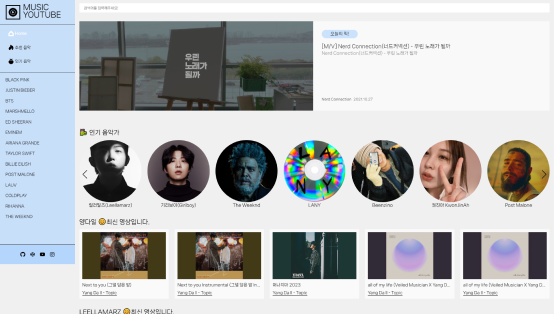

# 나만의 음악 유튜브 사이트 만들기

## 개요

- **프로젝트 목표**: 유튜브 API를 활용하여 사용자가 좋아하는 뮤지션들과 구독자 수가 많은 음악가들의 영상을 탐색할 수 있는 사이트 구축
- **기술 스택**: `React`, `Recoil`, `axios`, `react-router-dom`, `Sass`


<div align=center>
<a href="https://youtube-project-nine.vercel.app/"></a>
    
_이미지 클릭하면 사이트로 이동합니다._
    
</div>


## 설치

```
npm install react-router-dom
npm install axios react-icons
npm install react-player
npm install sass
npm install swiper
npm install recoil
react-helmet-async swiper
```

1. react-router-dom: React 애플리케이션에서 라우팅을 구현하기 위한 패키지. URL 경로에 따라 다른 컴포넌트를 렌더링하거나 페이지 간의 전환을 관리하기 위해 사용했습니다.
2. axios: HTTP 요청을 보내고 응답을 받기 위한 패키지. 서버와의 API 통신과 데이터 요청을 위해 사용했습니다.
3. react-icons: 다양한 아이콘을 사용하기 위한 패키지. React 컴포넌트 형태로 아이콘을 쉽게 표현할 수 있어 사용했습니다.
4. react-player: 비디오나 오디오 재생을 위한 패키지. 미디어 파일을 재생하고 컨트롤하기 위해 사용했습니다.
5. react-helmet-async: 동적으로 HTML <head> 요소를 수정하기 위한 패키지. 페이지의 제목, 메타 태그, 스타일 시트 등을 동적으로 변경하기 위해 사용했습니다.
6. swiper: 모바일 터치 슬라이더나 갤러리 형식의 컴포넌트를 만들기 위한 패키지. 슬라이드효과를 구현하기 위해 사용했습니다.
7. recoil: 반응형을 위해 헤더를 없애고 햄버거메뉴를 넣은 후 햄버거메뉴를 클릭하면 헤더가 나타나도록 toggleMenu 상태를 공유하기 위해 사용했습니다.

## 기술 스택

### 주요 라이브러리 및 프레임워크

- `React`: 사용자 인터페이스를 구축하기 위한 주요 프레임워크.
- `React Router`: 페이지 라우팅을 관리.
- `Axios`: HTTP 요청을 보내고 응답을 처리.
- `React` Icons: 다양한 아이콘을 사용하여 UI를 개선.
- `React` Player: 비디오 재생 기능 구현.
- `SASS`: 스타일링을 위한 CSS 전처리기.
- `Swiper`: 감각적인 슬라이더 기능 구현.
- `React` Helmet Async: SEO 최적화 및 동적인 head 태그 관리.

### 상태 관리

- `Recoil`: 전역 상태 관리를 위한 라이브러리. 애플리케이션 전반의 상태를 쉽게 관리하고, 컴포넌트 간 상태 공유를 용이하게 합니다.

## 개발 과정

### 1. 프로젝트 초기 설정

- React 애플리케이션 구성: `npx create-react-app`
- 필요한 라이브러리 설치: react-router-dom, axios, react-icons, react-player, sass, swiper, react-helmet-async

### 2. 라우팅 및 페이지 구조 설계

- `react-router-dom`을 사용하여 애플리케이션의 라우팅 구조 설계
- 홈, 오늘의 추천 음악, 인기 뮤지션, 개별 채널 페이지 등을 포함하는 다중 페이지 구조 구현

### 3. Recoil 상태 관리

- Recoil을 도입하여 전역 상태 관리 구현
- 사용자 인터페이스의 다양한 상태(예: 메뉴 토글) 관리

### 4. API 통신과 데이터 처리

- `axios`를 사용하여 YouTube Data API와 통신
- 비동기 요청 및 응답 처리를 위한 async-await 패턴 적용

### 5. UI 구성 및 스타일링

- React 컴포넌트를 활용하여 사용자 인터페이스 구성
- Sass를 사용하여 반응형 디자인 및 세련된 스타일링 적용

### 6. 네트워크 오류 해결

- 네트워크 오류(404 에러) 발생 시 디버깅
- 오류 로그 분석 및 API 호출 URL 수정을 통해 문제 해결

### 7. 최적화 및 배포

- `react-helmet-async`를 사용하여 SEO 최적화
- 최종 애플리케이션을 웹에 배포

## 주요 기능

- 유튜브 API 연동: 유튜브로부터 뮤지션과 음악 비디오 데이터를 실시간으로 가져옵니다.
- 동적 라우팅: React Router를 사용하여 다양한 페이지 간의 이동을 구현합니다.
- 커스텀 UI 구축: React와 SASS를 활용하여 사용자 인터페이스를 디자인하고 구현합니다.
- 비디오 재생 기능: React Player를 사용하여 유튜브 비디오를 재생합니다.
- 반응형 웹 디자인: Swiper와 미디어 쿼리를 활용하여 모든 디바이스에서 적절한 사용자 경험을 제공합니다.

## development notes

<details>
    
- Postman
  Postman은 API 개발 및 테스트를 위한 프로그램입니다. Postman을 사용하면 웹 서비스를 호출하고 응답을 확인할 수 있으며, API 요청을 생성하고 관리할 수 있습니다. Postman은 사용자가 웹 API를 테스트하고 디버깅하는 데 도움이 되는 다양한 기능을 제공합니다. 예를 들어, 다양한 HTTP 메서드(GET, POST, PUT, DELETE 등)를 사용하여 API를 호출하고, 요청에 필요한 헤더와 매개변수를 설정할 수 있습니다. 또한, API 응답을 검사하고 검증할 수 있는 기능도 제공합니다. Postman은 개발자들 사이에서 널리 사용되며, API 개발 및 테스트 작업을 효율적으로 수행할 수 있도록 도와줍니다.
- REST Pull API
  REST Pull API는 REST 아키텍처를 기반으로 데이터를 가져오는 API입니다. REST는 Representational State Transfer의 약자로, 웹 서비스 간의 통신을 위한 아키텍처 스타일입니다. REST Pull API는 클라이언트가 서버로부터 데이터를 요청하고 가져오는 방식으로 작동합니다.
  REST Pull API를 사용하여 데이터를 가져오기 위해서는 다음과 같은 단계를 따를 수 있습니다:
  API 엔드포인트 식별: 데이터를 가져올 대상 서버의 API 엔드포인트를 식별합니다. 엔드포인트는 서버에서 제공하는 특정 리소스에 대한 URL입니다.
  HTTP 요청 생성: GET 메서드를 사용하여 데이터를 가져오기 위한 HTTP 요청을 생성합니다. 이 요청은 엔드포인트 URL과 필요한 매개변수, 헤더 등을 포함할 수 있습니다.
  요청 전송: 생성한 HTTP 요청을 서버로 전송합니다. 이를 통해 서버는 요청을 처리하고 관련 데이터를 응답으로 반환합니다.
  응답 처리: 서버로부터 받은 응답을 클라이언트에서 처리합니다. 응답은 JSON, XML 등의 형식으로 전달될 수 있으며, 클라이언트는 이를 파싱하여 필요한 데이터를 추출하고 활용할 수 있습니다.
  REST Pull API는 다양한 웹 서비스와 통합하고 데이터를 가져오는 데 사용됩니다. 예를 들어, 외부 서비스의 데이터를 가져와서 애플리케이션에 표시하거나 분석하는 등의 작업에 활용할 수 있습니다.
- react Suspense
  https://www.daleseo.com/react-suspense/
  React의 Suspense는 컴포넌트가 준비될 때까지 로딩 상태를 표시하는 방법을 제어하는 기능입니다.
  Suspense는 우리가 데이터를 불러오는 동안 일시적으로 "대기" 상태를 표현할 수 있게 해줍니다. 예를 들어, API 호출 결과를 기다리는 동안 로딩 스피너를 보여주는 것과 같은 작업을 수행할 수 있습니다.
  Suspense를 사용하면, 우리는 이러한 비동기 로직을 컴포넌트의 바깥으로 빼내고, 대신 컴포넌트 내부에서 필요한 데이터가 준비되었는지 여부만을 신경쓰면 됩니다. 이는 코드의 가독성을 높여주며, 비동기 로직 처리를 더욱 수월하게 만들어 줍니다.
- recoil  
  Recoil은 Facebook에서 개발한 상태 관리 라이브러리입니다. 컴포넌트 간의 상태 공유를 쉽게 할 수 있으며, 성능도 우수합니다. 이 프로젝트에서는 Recoil을 사용하여 다양한 컴포넌트의 상태를 효율적으로 관리하였습니다.
- React Hooks (useParams, useEffect, useState): 페이지간 동적 라우팅, 데이터 페칭, 로컬 상태 관리 등에 사용됩니다.
- Postman: API 개발 및 테스트에 사용되며, 웹 API의 테스트와 디버깅에 활용됩니다.
- Swiper: 슬라이더 및 네비게이션 기능을 구현하는 데 사용되며, 자동 재생 같은 기능을 통해 사용자 편의성을 향상시킵니다.
- .env 파일: 프로젝트의 보안과 유지보수를 위해 민감한 정보 및 환경 변수를 저장합니다.
- react-helmet-async: SEO 최적화 및 동적인 head 태그 관리를 위해 사용됩니다.
- React의 Suspense와 lazy: 비동기적으로 로드된 컴포넌트의 로딩 상태를 관리하고, 필요할 때에만 컴포넌트를 로드하는 코드 분할을 위해 사용됩니다.
- useNavigate: 페이지 URL 업데이트 및 히스토리 관리를 위해 사용되며, 사용자에게 빠른 피드백을 제공합니다.
- try, catch: JavaScript의 예외 처리 방식. 코드 실행 중 발생할 수 있는 오류를 안전하게 처리합니다.
- async, await: JavaScript에서 비동기 작업을 쉽게 처리할 수 있게 해주는 구문. 코드의 가독성을 높여 줍니다.
- useParams: React Router의 기능. 동적인 라우팅에서 URL의 매개변수를 추출하는 데 사용됩니다.
- recoil: Recoil은 Facebook에서 개발한 상태 관리 라이브러리입니다. 컴포넌트 간의 상태 공유를 쉽게 할 수 있으며, 성능도 우수합니다. 이 프로젝트에서는 Recoil을 사용하여 header의 상태를 관리하였습니다.
</details>

## 배운 점

- React와 Recoil을 활용한 효율적인 상태 관리
- REST API와의 효과적인 통신 방법
- 오류 해결을 위한 체계적인 디버깅 프로세스

## 트러블 슈팅

<details>
    <summary>429error</summary>
    - rapid api 요청 수 초과 -> 24시간 후 정상 작동

</details>
